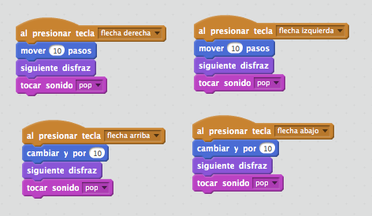
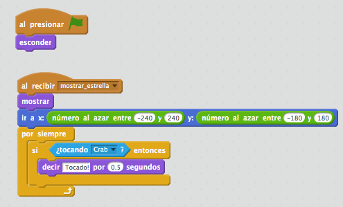
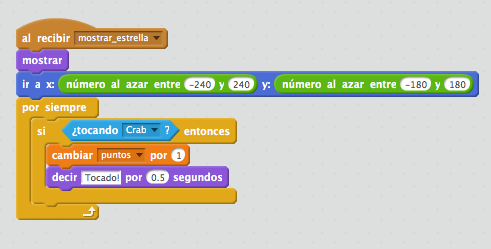
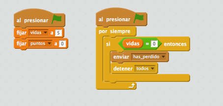

# Taller de Scratch
**Título:** Programa tu primer videojuego con [Scratch][1].  
**Descripción:** Taller de Scratch impartido en el encuentro Biprovincial de voluntarios y voluntarias de [Andalucía Compromiso Digital][2] (ACD) de las provincias de Almería y Granada.  
**Fecha:** 10 marzo de 2017.

# Bienvenidos a Scratch 2.0

## ¿Qué es Scratch?

Scratch es un entorno de programación amigable basado en bloques que nos permite
crear proyectos digitales.

Creado por el **MIT Media Lab Lifelong Kindergarten Group**.

## ¿Cómo puedo usar Scratch?

* [Online][3]
* [Offline][4]

## ¿Qué tipo de proyectos puedo crear con Scratch?

Con Scratch podemos crear: 
* historias interactivas.
* animaciones.
* juegos.
* ...

Es una herramienta útil para aprender a programar.

## Ejercicios

Examina todos los bloques que tenemos disponibles en Scratch 2.0:

* Movimiento
* Apariencia
* Sonido
* Lápiz
* Eventos
* Control
* Sensores
* Operadores
* Más bloques

### Ejercicio 0. Cambiar el fondo del escenario

Selecciona el fondo **xy-grid**.

### Ejercicio 1. Mover un objeto con las teclas de dirección

Utiliza los bloques:

* `al presionar tecla _`
* `mover _ pasos`
* `cambiar y por _`
* `siguiente disfraz`
* `tocar sonido _`

### Ejercicio 2. Añadir un nuevo objeto de la biblioteca de objetos

Elimina el objeto que aparece por defecto y añade un nuevo objeto.

Añadimos el objeto **Crab** a nuestro proyecto y lo programamos para que se
mueva con las teclas de dirección, cambie el disfraz y reproduzca un sonido al
moverse.

### Ejercicio 3. Programar el movimiento automático de un personaje

Añadimos un nuevo objeto (**Octopus**) y lo programamos para que se desplace
automáticamente por la pantalla y rebote cada vez que se encuentra con un borde.

Utiliza los bloques:

* `apuntar en dirección _`
* `por siempre`
* `mover _ pasos`
* `siguiente disfraz`
* `esperar _ segundos`
* `rebotar si toca un borde` 

### Ejercicio 4. Posición aleatoria

Añadir el objeto **Starfish** y programarlo para que aparezca en una posición
aleatoria cada vez que se inicie el juego.

Utiliza los bloques:

* `ir a x: _ y: _`
* `número al azar entre _ y _`

### Ejercicio 5. Cambiamos el fondo

Una vez que nos hemos familiarizado con el grid de Scratch y conocemos cómo funciona el sistema de coordenadas ya podemos cambiar el fondo por un fondo más apropiado para nuestro videojuego. En nuestro caso seleccionaremos el fondo **underwater1**.

### Ejercicio 6. Comprobar colisiones entre objetos

Comprueba cada vez que el objeto **Crab** colisiona con el objeto **Starfish**.

Utiliza los bloques:

* `por siempre`
* `si`
* `¿tocando _ ?`
* `decir _ por _ segundos`
* `tocar sonido`

### Ejercicio 7. Eventos y paso de mensajes entre objetos

Al inicio del juego todos los objetos estarán ocultos y cuando se pulse sobre el
icono de la bandera verde los objetos se harán visibles.

Cuando se pulse sobre el icono de la bandera verde se esperarán 3 segundos y se
enviará un mensaje a cada uno de los objetos (**mostrar_cangrejo**, **mostrar_estrella** y **mostrar pulpo**) para indicar que el juego va a comenzar y deben aparecer.

**Escenario**

Utiliza los siguientes bloques para enviar los mensajes **mostrar_cangrejo**, **mostrar_estrella** y **mostrar pulpo**:

* `al presionar bandera`
* `esperar _ segundos`
* `enviar _`

**Crab**

Utiliza los bloques:

* `al presionar bandera`
* `esconder`
* `al recibir _`
* `mostrar`

**Starfish**

Utiliza los bloques:

* `al presionar bandera`
* `esconder`
* `al recibir _`
* `mostrar`

**Octopus**

Utiliza los bloques:

* `al presionar bandera`
* `esconder`
* `al recibir _`
* `mostrar`

### Ejercicio 8. Paso de mensajes

Cuando el objeto **Crab** colisiona con el objeto **Starfish**, éste tiene que desaparecer y volver a aparecer en otra posición aleatoria de la pantalla.

El objeto **Starfish** se puede enviar un mensaje a sí mismo para volver a repetir el mismo comportamiento.

Utiliza los bloques:

* `esconder`
* `enviar _`

### Ejercicio 9. Puntuación

Vamos a crear una variable llamada **puntos** para guardar el número de veces
que el objeto **Crab** colisiona con el objeto **Starfish**.

* Al inicio del juego variable debe estar inicializada a 0.
* Cada vez que el objeto **Crab** colisiona con el objeto **Starfish** incrementamos en 1 su valor.

**Escenario**

Utiliza los bloques:

* `fijar _ a 0`

**Starfish**

Utiliza los bloques:

* `cambiar _ por 1`

### Ejercicio 10. Comprobar cuando se alcanza una determinada puntuación

El juego finaliza cuando se hayan alcanzado 5 puntos.

En alguna parte del juego habrá que ir comprobando cuál es el valor de la
variable **puntos** y cuando este valor sea igual a 5 detendremos el juego y
enviaremos el mensaje **has_ganado** a todos los objetos para avisar que el
juego ha terminado con éxito.

También sería conveniente mostrar un texto indicando que el juego ha terminado
con éxito. Para crear un texto ha que añadir un nuevo objeto de la categoría *Letras*. A este objeto lo vamos a llamar **Win**.

**Escenario**

Utiliza los bloques:

* `al presionar bandera` 
* `por siempre`
* `si _ entonces`
* `operador =`

**Starfish, Crab y Octopus**

Utilizan los bloques:

* `al recibir _`
* `esconder`

**Win**

Utiliza los bloques:

* `al recibir _`
* `mostrar`
* `tocar sonido`

### Ejercicio 11. Detectamos colisiones de los enemigos con el jugador

Ahora tenemos que detectar cada vez que un enemigo colisiona con el jugador, que
en nuestro caso es el objeto **Crab**. 

Utiliza los bloques:

* `al recibir _`
* `por siempre`
* `si _ entonces`
* `¿tocando _ ?`
* `tocar sonido`
* `decir _ por _ segundos`

### Ejercicio 12. Duplicamos el objeto *Octopus* para crear más enemigos

Con la herramienta de **Duplicar** vamos a crear varias copias del objeto **Octopus**.
Una vez creadas vamos a modificar el valor del bloque `apuntar en dirección _` asignando un ángulo diferente para cada objeto con el objetivo de tener a todos los **Octopus** moviéndose aleatoriamente con sentidos diferentes.

### Ejercicio 13. Limitamos el número de vidas del jugador

Vamos a crear una variable llamada **vidas** para guardar el número de vidas que
tiene el **Crab**. Cada vez que el **Crab** colisiona con un **Octopus** el
número de vidas se decrementa en 1.

**Escenario**

**Octopus**

### Ejercicio 14. Fin del juego cuando las vidas lleguen a 0

El juego finaliza cuando el **Crab** se haya quedado con 0 vidas.

En alguna parte del juego habrá que ir comprobando cuál es el valor de la
variable **vidas** y cuando este valor sea igual a 0 detendremos el juego y
enviaremos el mensaje **has_perdido** a todos los objetos para avisar que el
juego ha terminado sin éxito.

También sería conveniente mostrar un texto indicando que el juego ha terminado
sin éxito. Para crear un texto ha que añadir un nuevo objeto de la categoría *Letras*. A este objeto lo vamos a llamar **GameOver**.

## Licencia

 Este obra está bajo una <a rel="license" href="http://creativecommons.org/licenses/by-nc-sa/4.0/">licencia de Creative Commons Reconocimiento-NoComercial-CompartirIgual 4.0 Internacional</a>.

[1]: https://scratch.mit.edu
[2]: https://www.andaluciacompromisodigital.org
[3]: https://scratch.mit.edu
[4]: https://scratch.mit.edu/scratch2download/
